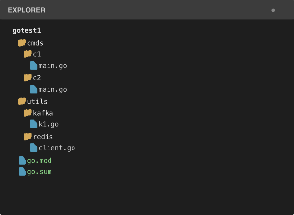
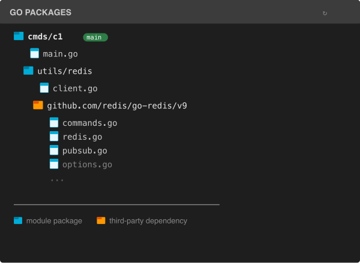
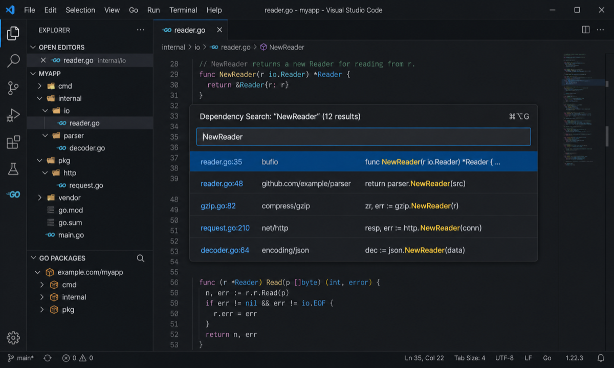

# Go Package View

A VS Code extension for exploring Go package dependency relationships in a
virtual Explorer tree and searching across all dependency source files.

Instead of navigating by filesystem layout, you navigate by import dependencies,
making it easy to understand how packages relate to each other.

---

## Comparison

<table>
<tr>
<th>File Explorer (filesystem)</th>
<th>Go Packages (dependency tree)</th>
</tr>
<tr>
<td></td>
<td></td>
</tr>
</table>

The **File Explorer** shows the project by filesystem layout. The **Go Packages** view
shows the same project by import dependency, starting from the `main` package
as the root and expanding through its imports recursively.

---

## Features

- **Dependency tree view** — automatically detects the `main` package(s) and
  builds a virtual directory tree from their import graph
- **Library mode** — for projects without a `main` package, builds a reverse
  dependency tree showing "what imports this package"
- **Colored icons** — blue folders for module-internal packages, orange folders
  for third-party dependencies
- **Open .go files** — click any file in the tree to open it in the editor
- **Search all dependencies** — search module, third-party, and standard-library
  Go source files, then jump directly to a matching line
- **Right-click actions** — Copy Import Path, Open in Terminal, New File,
  New Subdirectory, Delete Folder, Reveal in Finder
- **Auto-refresh** — watches `go.mod`, `go.sum`, and `.go` files; automatically
  rebuilds the tree when dependencies change

---

## Global dependency search

Search any text across every Go source file discovered by
`go list -json -deps ./...`, including files from the current module,
third-party modules, and the Go standard library.

- Start it from anywhere with `Ctrl+Alt+G` on Windows/Linux or
  `Cmd+Option+G` on macOS; opening the Explorer view first is not required
- Alternatively, click the search icon in the **Go Packages** title bar or run
  **Go Package View: Search All Dependencies** from the Command Palette
- Search is case-insensitive, cancellable, and scans files concurrently
- Results include the file, line number, package import path, and matching code
- Select a result to open the source file and highlight the matching text
- Up to 500 matches are displayed for each search



---

## Requirements

- [Go](https://go.dev/) 1.21+ installed and in `$PATH`
- A Go project with a `go.mod` file in the workspace root or `src/`

---

## Usage

1. Open any Go project folder in VS Code
2. The **Go Packages** section appears at the bottom of the Explorer panel
3. Click the expand arrow on a package node to see its imports and source files
4. Click a `.go` file to open it in the editor
5. Right-click a package or file node for additional operations

### Right-click menu

| Action | Context | Description |
|---|---|---|
| Copy Import Path | package | Copies the full import path to clipboard |
| Open in Terminal | package | Opens integrated terminal at the package directory |
| New File | package | Creates a new `.go` file with auto-detected `package` declaration |
| New Subdirectory | package | Creates a subdirectory with an init `.go` file |
| Delete Folder | package | Deletes the package directory and all contents |
| Reveal in Finder | file | Shows the file in the OS file manager |
| (click) | file | Opens the file in the editor |

---

## Configuration

| Setting | Default | Description |
|---|---|---|
| `goPackageView.autoRefresh` | `true` | Auto-rebuild tree when `go.mod` or `.go` files change |
| `goPackageView.maxDepth` | `0` | Max tree expansion depth (`0` = unlimited) |

---

## Development

### Project structure

```
├── src/
│   ├── extension.ts       ← extension entry point, command registration
│   ├── goListRunner.ts    ← `go list -json` execution & parsing
│   ├── dataStore.ts       ← in-memory cache & tree building
│   ├── dependencySearch.ts ← dependency source search & result navigation
│   ├── treeProvider.ts    ← VS Code TreeDataProvider
│   ├── types.ts           ← shared type definitions
│   └── log.ts             ← console.log wrapper
├── icons/                 ← SVG icons for tree nodes
├── docs/                  ← documentation images
├── dist/                  ← build output
├── package.json           ← VS Code extension manifest
├── tsconfig.json
└── build.js               ← esbuild config
```

### Build & debug

```bash
npm install
npm run build        # dist/extension.js
npm run watch        # incremental rebuild
```

Press **F5** to launch the Extension Development Host window.
Open the **Developer Tools** (`CMD+Shift+I`) to see `[GoPkgView]` log output.

### How it works

1. Extension activation finds `go.mod` in the workspace root, `src/`, or a parent directory, then runs `go list -json -deps ./...` there
2. Output is parsed by tracking `{`/`}` brace depth (handles multi-line JSON)
3. Packages with `Name === "main"` become root nodes; if none found, the
   extension switches to library mode (reverse dependency tree)
4. Tree nodes are built lazily from an in-memory `Map<string, PackageInfo>`
5. File changes trigger a debounced refresh of the entire tree

---

## License

MIT
